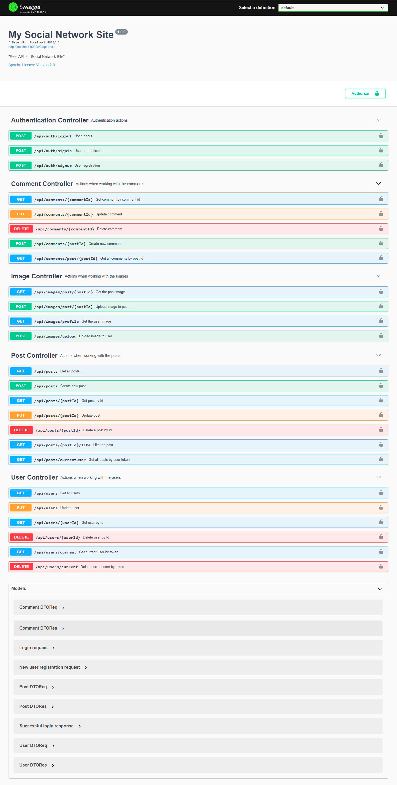
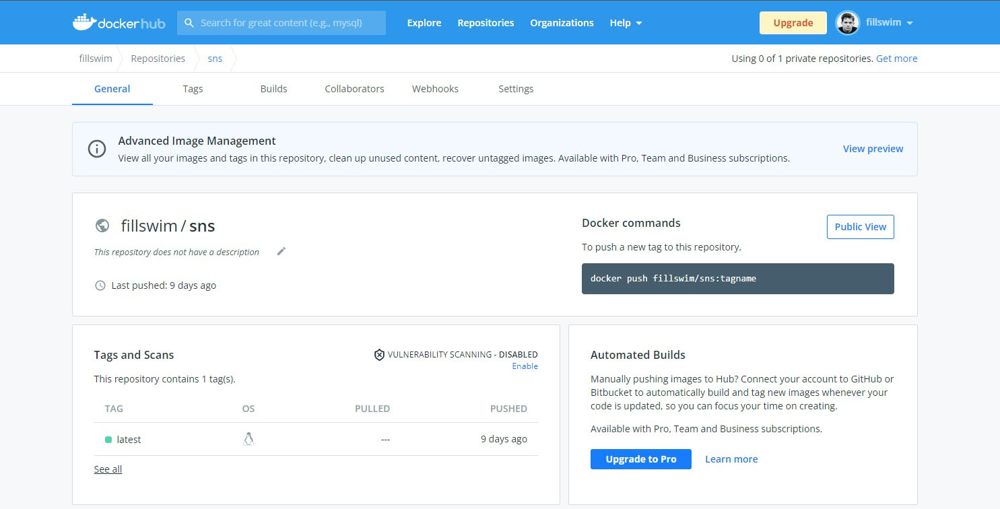
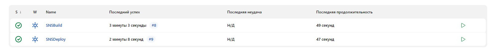
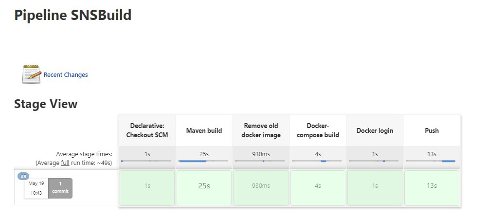
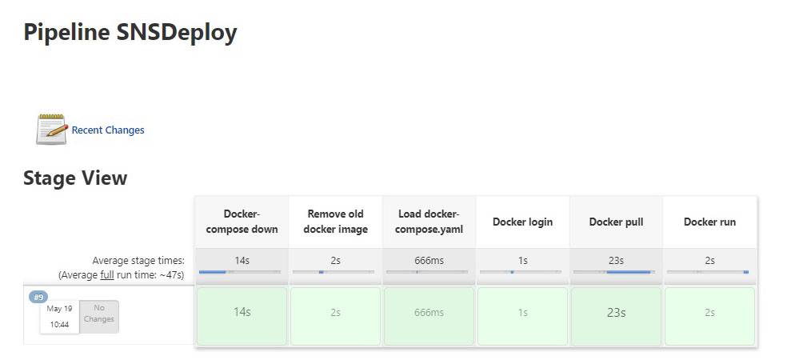

# My Social Networking Site

## Technology Stacks:
**Core:**
- Java 11
- Maven
- Spring Boot
- Lombok
- MapStruct

**Database:**
- Spring Data JPA
- Hibernate
- PostgreSQL
- Flyway

**Security:**
- Spring Security
- JWT Authentication

**Tests:**
- Junit
- Mockito
- Testcontainers

**API Documentation:**
- Swagger

**CI/CD:**
- Docker
- Docker Compose
- Docker Hub
- Jenkins Pipeline
- Amazon EC2

## Swagger

  

## AWS

  

## Jenkins

  

  

  

## Docker Hub

  

